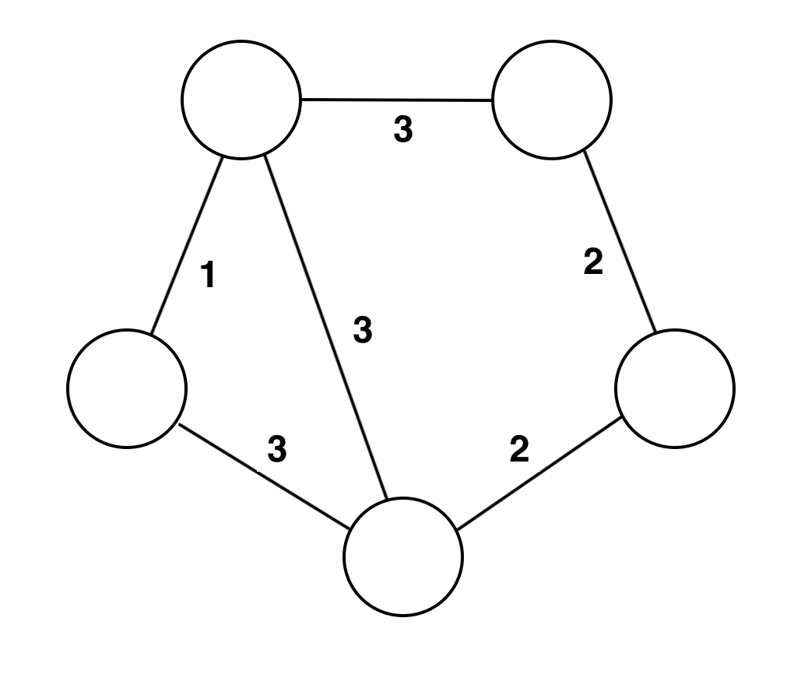

### The Variational Quantum Eigensolver-inator: Examining the inner-workings of the VQE algorithm

#### Why are you reading this?

Seriously, life choices you've made so far have brought you to reading about how a quantum computing algorithm named Variational Quantum Eigensolver works. Maybe it's time to evaluate your life choices, or if you're good with them, please read on! 

The Variational Quantum Eigensolver, or VQE for short, is a quantum computing algorithm that is well suited for solving certain classes of problems using quantum computers available in the near term. VQE may be used for problems involving modeling nature, including chemistry, as [Dr. Richard Feynmann challenged the world to do](https://en.wikipedia.org/wiki/Quantum_computing#Timeline). VQE is also great at finding optimal combinations of things, for example finding the shortest route for visiting a list of cities. This is known as the [Traveling Salesman Problem](https://en.wikipedia.org/wiki/Travelling_salesman_problem), and mathematicians call these sorts of challenges [combinatorial optimization](https://en.wikipedia.org/wiki/Combinatorial_optimization) problems.

The open source [Qiskit Aqua library](https://qiskit.org/aqua) contains an implementation of the VQE algorithm, so you may use VQE without understanding how it works. Given that you're still reading this, however, we'd suggest using the Aqua VQE code as a reference to see how the inner workings described here are implemented in code. 

#### Stuff Physicists say

Some words that we'll use here such as [Hamiltonian](https://en.wikipedia.org/wiki/Hamiltonian_(quantum_mechanics)) are bandied about by physicists, mathematicians, and theoretical computer scientists, but in most cases they are just fancy words that represent straightforward concepts. There are some concepts and notations used in this article, however, that we'll assume that you're familiar with. You can get up to speed on these in the [Learning Qiskit: for Developers](https://learnqiskit.gitbook.io/developers) guide, working through all of the material up to and including the *Getting Started with Qiskit* section.

#### Using VQE to solve a coloring puzzle

Take a few moments to solve the following graph coloring puzzle that involves filling in some of its circles (vertices) with one color, and the rest of its circles with another color. We'll use the colors *red* and *blue* in this discussion. Solving the puzzle successfully requires achieving the highest possible score, which is defined as the total of the numbers (weights) on the lines (edges) connecting circles that have different colors.

*Fig 1: Graph coloring puzzle*

Hint: The highest possible score for the preceding puzzle (or problem if you prefer) is 13, and there are two possible solutions. Please get out your crayons and solve this puzzle before peeking at one of these solutions shown in the next drawing.

##### The relevance of this graph coloring problem

Coloring the vertices of this graph with two colors can model real world problems such as social network interactions and marketing influencers. It is another way of expressing the [MaxCut problem](https://en.wikipedia.org/wiki/Maximum_cut), in which the score is calculated by adding up the weights on the edges that are cut by a line drawn between vertices of different colors:

*Fig 2: MaxCut solution to our coloring problem*

##### Using physics to solve this problem

One way of thinking about this problem is in the context of magnetism, specifically [antiferromagnetism](https://en.wikipedia.org/wiki/Antiferromagnetism), where the natural tendency is for neighboring electrons to have spins pointing in opposite directions (e.g. *up* and *down*). Using this analogy, the color of a given vertex could correspond to an electron's spin orientation, with blue vertices representing *spin up*, and red vertices representing *spin down*. The strength of an interaction between neighboring vertices is represented by the weight of the edge between them. Because the natural tendency  in this analogy is for neighboring vertices to have opposite colors, and the strength of that tendency is the weight on the edge between them, the [lowest energy (ground) state](https://en.wikipedia.org/wiki/Ground_state) of our graph corresponds to its MaxCut solutions. Let's take a look at one way that physisicts find the lowest energy states of a system.

##### There is no *H* in quantum computing

Actually, there are an overabundance of terms in quantum computing that begin with the letter *H*: [Hadamard gates](https://en.wikipedia.org/wiki/Quantum_logic_gate#Hadamard_(H)_gate), [Hermitian matrices](https://en.wikipedia.org/wiki/Hermitian_matrix), [Hilbert spaces](https://en.wikipedia.org/wiki/Hilbert_space) and [Hamiltonian operators](https://en.wikipedia.org/wiki/Hamiltonian_(quantum_mechanics)) to name a few. We'll now examine how to leverage that last term, Hamiltonian operators, to find the lowest energy state of our graph. Let's consider a graph with three vertices and weights as shown in the following diagram.

The graph has already been colored with one of its MaxCut solutions, namely, 3, as the sum of the cuts between nodes of different colors is 3. The energy for that coloring is $-2$, because the weight total between opposite color vertices is $-3$ and the weight total between same color vertices is 1. Adding these totals yields $-2$.

There are $2^3$ combinations with which the vertices in our graph may be colored. The energy states for each of these combinations are represented on the [main diagonal](https://en.wikipedia.org/wiki/Main_diagonal) of the following Hermitian matrix.  
$$
\begin{bmatrix}
  2 & 0 & 0 & 0 & 0 & 0 & 0 & 0 \\
  0 & 0 & 0 & 0 & 0 & 0 & 0 & 0 \\
  0 & 0 & -1 & 0 & 0 & 0 & 0 & 0 \\
  0 & 0 & 0 & -1 & 0 & 0 & 0 & 0 \\
  0 & 0 & 0 & 0 & -1 & 0 & 0 & 0 \\
  0 & 0 & 0 & 0 & 0 & -1 & 0 & 0 \\
  0 & 0 & 0 & 0 & 0 & 0 & 0 & 0 \\
  0 & 0 & 0 & 0 & 0 & 0 & 0 & 2 \\
 \end{bmatrix}
 \begin{matrix}
 CBA \\
 \vert000\rangle \\
 \vert001\rangle \\
 \vert010\rangle \\
 \vert011\rangle \\
 \vert100\rangle \\
 \vert101\rangle \\
 \vert110\rangle \\
 \vert111\rangle \\
 \\
 \end{matrix}
$$

This matrix serves as our *Hamiltonian operator*, as we'll use it in operations to determine energy values of our graph. To the right of the matrix are basis states that represent the possible color combinations, with $0$ denoting red and $1$ denoting blue. For example the fourth row of the matrix represents the energy state ($-1$) of our graph when the A and B vertices are colored blue, and the C vertex is colored red. To obtain the energy value from this matrix for a given basis state, we'll first multiply the matrix by a column vector that represents the basis state. For example, the following operation yields a vector that contains the energy value for the $\vert011\rangle$ basis state.
$$
\begin{bmatrix}
  2 & 0 & 0 & 0 & 0 & 0 & 0 & 0 \\
  0 & 0 & 0 & 0 & 0 & 0 & 0 & 0 \\
  0 & 0 & -1 & 0 & 0 & 0 & 0 & 0 \\
  0 & 0 & 0 & -1 & 0 & 0 & 0 & 0 \\
  0 & 0 & 0 & 0 & -1 & 0 & 0 & 0 \\
  0 & 0 & 0 & 0 & 0 & -1 & 0 & 0 \\
  0 & 0 & 0 & 0 & 0 & 0 & 0 & 0 \\
  0 & 0 & 0 & 0 & 0 & 0 & 0 & 2 \\
 \end{bmatrix}
 \cdot
 \begin{bmatrix}
 0 \\
 0 \\
 0 \\
 1 \\
 0 \\
 0 \\
 0 \\
 0
 \end{bmatrix}
 =
 \begin{bmatrix}
 0 \\
 0 \\
 0 \\
 -1 \\
 0 \\
 0 \\
 0 \\
 0
 \end{bmatrix}
$$

> Note: Multiplying this vector with this matrix yields the same result as multiplying this vector with a scalar, in this case $-1$. Therefore, this vector is an [eigenvector](https://en.wikipedia.org/wiki/Eigenvalues_and_eigenvectors) of the matrix, and the eigenvalue of this eigenvector is $-1$. In fact, this matrix has exactly eight eigenvectors, with their associated eigenvalues appearing on the main diagonal.

To obtain the energy value as a scalar from the vector that contains it above, we'll take the inner product of it with a row vector that represents the $\vert011\rangle$ basis state.
$$
\begin{bmatrix}
  0 & 0 & 0 & 1 & 0 & 0 & 0 & 0
 \end{bmatrix}
 \cdot
 \begin{bmatrix}
 0 \\
 0 \\
 0 \\
 -1 \\
 0 \\
 0 \\
 0 \\
 0
 \end{bmatrix}
 = -1
$$
To express these calculations more succinctly, we'll use [Dirac bra-ket](https://en.wikipedia.org/wiki/Bra%E2%80%93ket_notation) notation, where the row vector is expressed as a *bra* and the column vector is expressed as a *ket*. The ***H*** symbol is our Hamiltonian operator, which is multiplied by the ket vector, and the resultant vector multiplied by the bra vector.

$\langle011\vert H\vert011\rangle=-1$

> This expression take the form $\langle\psi\vert H\vert\psi\rangle$ and is known as the [expectation value](https://en.wikipedia.org/wiki/Expectation_value_(quantum_mechanics)). Here we expect the energy value for the given basis state, but as demonstrated later, an expectation value is the average of all the possible outcomes of a measurement as weighted by their likelihood.

| + Shift | - Energy      | = Cut   |
| ------- | ------------- | ------- |
| 4/2 (2) | (+3+1)/2 (2)  | 0/2 (0) |
| 4/2 (2) | (+3-1)/2 (1)  | 2/2 (1) |
| 4/2 (2) | (-3+1)/2 (-1) | 6/2 (3) |
| 4/2 (2) | (-3-1)/2 (-2) | 8/2 (4) |

#### Glossary

| Term                                                     | Meaning                                             |
| -------------------------------------------------------- | --------------------------------------------------- |
| [Ansatz](https://en.wikipedia.org/wiki/Ansatz)           | Educated guess that is made more accurate over time |
| [MaxCut](https://en.wikipedia.org/wiki/Maximum_cut)      |                                                     |
| MaxCut shift                                             |                                                     |
| Hamiltonian                                              |                                                     |
| [Ising model](https://en.wikipedia.org/wiki/Ising_model) |                                                     |
|                                                          |                                                     |

